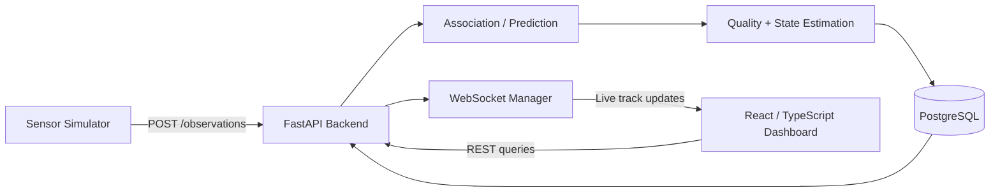

# Sensor Track System

> **A portfolio implementation of a real-time multi-sensor tracking pipeline inspired by operational ISR workflows.**

Tracking, correlation, logging, and visualization system built with FastAPI, PostgreSQL, React, TypeScript, Docker, and WebSockets.

The project simulates a limited aerospace operational picture using synthetic radar and electro-optical sensor reports. Incoming observations are validated, correlated against system-owned tracks, persisted to PostgreSQL, and distributed to a live operator dashboard.

The project is intentionally focused on explainable tracking logic and software engineering rather than advanced or classified sensor-fusion algorithms.

---

## Dashboard Screenshot


## Quick Demo

1. Start the application:

   ```powershell
   docker compose up -d --build
   ```

2. Start the synthetic simulator:

   ```powershell
   python simulator/sensor_simulator.py
   ```

3. Open:

   ```text
   http://127.0.0.1:8080
   ```

4. Watch for:

   - system-owned `SYS-*` tracks being created
   - live track movement and heading changes
   - track quality increasing as evidence accumulates
   - ACTIVE, STALE, and DROPPED transitions
   - multi-sensor correlation and reacquisition
   - historical altitude and speed charts

5. View backend tracking decisions:

   ```powershell
   docker compose logs backend -f
   ```

## Overview

Individual sensors report observations containing:

- sensor identity
- sensor-owned track identity
- latitude
- longitude
- altitude
- heading
- speed
- timestamp

The backend does not treat a sensor's track ID as the authoritative identity.

Instead, the application creates and maintains its own system-owned identifiers:

```text
RADAR-01 / RDR-441
EO-02    / EO-827
        ↓
SYS-A1B2C3D4E5F6
```

This allows observations from multiple sensors to contribute to the same system-level track.

---

## Core Capabilities

### Multi-Sensor Association

Incoming observations are evaluated using:

- recent source continuity
- observation timing
- predicted track position
- geographic distance
- altitude difference
- speed difference
- heading difference

Candidate tracks outside configured gates are rejected.

Remaining candidates receive a normalized association score, where lower values represent better matches.

If no candidate qualifies, a new `SYS-*` track is created.

### Source Continuity and Reacquisition

Sensor identities are trusted only for a limited continuity window.

A previously seen:

```text
sensor_id + source_track_id
```

can preserve direct continuity while it is recent.

If that continuity expires, the observation must pass normal physical correlation before it can reconnect to the previous system track.

This prevents reused sensor track IDs from automatically inheriting an unrelated historical track.

### Track Quality

Each system track maintains a quality value between:

```text
0.00 → 1.00
```

New tracks begin at:

```text
0.50
```

Quality evolves based on continued supporting evidence.

Source continuity increases quality, strong correlations increase it further, and weak correlations can reduce it.

Track quality is separate from track freshness.

### State Estimation

Raw observations are preserved exactly as reported by the sensor.

The current `Track` state represents the system's estimated belief and is smoothed rather than directly overwritten by every incoming measurement.

The estimator currently blends:

- latitude
- longitude
- altitude
- speed
- heading

Heading uses circular-angle logic so transitions such as:

```text
359° → 1°
```

are handled correctly.

### Source Provenance

The system records which sensor/source identities have contributed to each system track.

For every contributor, PostgreSQL stores:

- sensor ID
- source track ID
- first seen
- last seen
- observation count

This allows the latest reporting sensor and the complete contributor history to remain separate concepts.

### Track Freshness

Tracks are classified by the age of their latest observation:

```text
ACTIVE
STALE
DROPPED
```

The current thresholds are:

```text
ACTIVE   < 10 seconds
STALE    >= 10 seconds
DROPPED  >= 30 seconds
```

A high-quality track can therefore still become stale or dropped if observations stop arriving.

---

## Architecture



The three primary persistence concepts are:

```text
Observation
= what the sensor reported

Track
= what the system currently believes

TrackSource
= who contributed to that belief
```

See [`docs/architecture.md`](docs/architecture.md) for the detailed system design.

---

## Technology Stack

### Backend

- Python 3.13
- FastAPI
- SQLAlchemy 2
- Pydantic
- PostgreSQL 17
- Alembic
- WebSockets
- Uvicorn

### Frontend

- React
- TypeScript
- Vite
- Leaflet / React-Leaflet
- Recharts

### Infrastructure

- Docker
- Docker Compose
- PostgreSQL persistent volumes
- Application health/readiness checks
- GitHub Actions CI

### Testing

- Pytest
- FastAPI TestClient
- SQLite test database with foreign-key enforcement

The current automated suite contains:

```text
63 passing tests
```

covering association, prediction, source lifecycle, quality, provenance, API behavior, state estimation, heading wraparound, and database behavior.

---

## Project Structure

```text
sensor_track_system/
├── app/
│   ├── models/
│   ├── routes/
│   ├── schemas/
│   ├── services/
│   ├── database/
│   ├── config.py
│   ├── logging_config.py
│   └── main.py
│
├── alembic/
├── docs/
│   ├── architecture.md
│   └── system_walkthrough.md
│
├── frontend/
│   └── src/
│
├── simulator/
├── tests/
├── Dockerfile
├── docker-compose.yml
├── requirements.txt
└── requirements-dev.txt
```

---

## Running the Application

Create your local environment file from the provided example:

```powershell
Copy-Item .env.example .env
```

Configure the required PostgreSQL settings in `.env`.

Then build and start the complete stack:

```powershell
docker compose up -d --build
```

Verify container health:

```powershell
docker compose ps
```

Expected services include:

```text
db        healthy
backend   healthy
frontend  running
```

The application is then available at:

```text
Frontend:
http://127.0.0.1:8080

FastAPI:
http://127.0.0.1:8000

Swagger / OpenAPI:
http://127.0.0.1:8000/docs
```

---

## Health and Readiness

The backend exposes two operational endpoints.

### Liveness

```http
GET /health
```

Confirms that the FastAPI application is running.

### Readiness

```http
GET /ready
```

Executes a database connectivity check.

A backend container is not considered healthy by Docker until the readiness endpoint confirms PostgreSQL is reachable.

---

## Main API Surfaces

### Observations

```http
POST /observations
GET /observations
GET /observations/{track_id}
GET /observations/{track_id}/latest
```

### Tracks

```http
GET /tracks
GET /tracks/{track_id}
GET /tracks/{track_id}/sources
```

Additional track search and status endpoints support dashboard filtering and inspection.

### WebSocket

```text
/ws/tracks
```

Successful track updates are broadcast to connected dashboard clients in real time.

---

## Synthetic Sensor Simulator

The simulator generates synthetic sensor reports approximately every two seconds.

It supports behaviors including:

- multiple sensors
- moving targets
- temporary sensor outages
- reacquisition
- track spawning
- track termination
- randomized synthetic observations

The simulator exists only to provide repeatable development and demonstration traffic.

No operational, classified, or real-world sensor feeds are used.

---

## Operator Dashboard

The React and TypeScript frontend provides:

- live interactive map
- moving and rotating track markers
- track selection
- current track quality
- ACTIVE / STALE / DROPPED status
- sensor information
- latitude and longitude
- altitude
- speed
- heading
- track trails
- selectable trail length
- search
- filtering
- historical altitude and speed charts

REST APIs provide initial and historical data while WebSockets provide live updates.

---

## Structured Logging

Important tracking decisions are emitted as application-level events such as:

```text
event=TRACK_CREATED
event=SOURCE_CONTINUITY
event=TRACK_CORRELATED
event=OBSERVATION_COMMIT_FAILED
```

This keeps normal Docker logs focused on meaningful system behavior while preserving framework tracebacks for failures.

---

## Database Migrations

Database schema evolution is managed through Alembic.

```powershell
alembic current
alembic heads
alembic upgrade head
```

The backend Docker container applies pending migrations before starting Uvicorn.

PostgreSQL data is stored in a persistent Docker volume.

Do not remove the database volume unless intentionally deleting the stored development database.

---

## Running Tests

From the project root with the Python virtual environment active:

```powershell
python -m pytest -v
```

The suite currently validates behavior including:

- observation ingestion
- track creation
- source continuity
- multi-sensor association
- ambiguous candidate selection
- prediction
- association confidence
- track quality
- TrackSource provenance
- source continuity expiration
- cross-sensor reacquisition
- track freshness
- REST routes
- state estimation
- circular heading smoothing
- foreign-key behavior
- health/readiness endpoints

---

## Design Philosophy

The project intentionally separates sensor reports from system belief.

Raw observations remain immutable historical evidence.

System tracks maintain an estimated current state derived from those observations.

Source provenance records identify which sensors contributed to a track.

Tracking algorithms are kept explainable and testable rather than introducing mathematical complexity solely for sophistication.

The result is a system that demonstrates both sensor-tracking concepts and full-stack software engineering practices.

---

## Current Status

The current version is a functional development and portfolio system with:

```text
Multi-sensor association        Complete
Prediction                      Complete
Track quality                   Complete
Source provenance               Complete
Source lifecycle protection     Complete
Cross-sensor reacquisition      Complete
State estimation                Complete
Circular heading smoothing      Complete
PostgreSQL persistence          Complete
Alembic migrations              Complete
Docker deployment               Complete
Health/readiness monitoring     Complete
Structured logging              Complete
React operator dashboard        Complete
GitHub Actions CI               Complete
Automated test suite            63 passing
```

Further development is focused primarily on software-engineering maturity, documentation, deployment, observability, and demonstration quality rather than adding unnecessary tracking algorithm complexity.
