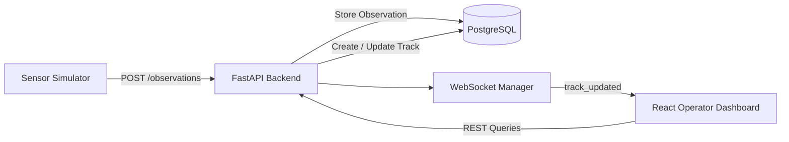

# Sensor Track System

A real-time sensor tracking and visualization platform built with FastAPI, PostgreSQL, React, TypeScript, WebSockets, and Docker.

The system accepts simulated sensor observations, maintains current track state, preserves historical observations, detects track freshness and loss, and broadcasts updates to a live operator-style dashboard.

The project is designed as a hands-on exploration of backend engineering, real-time systems, sensor tracking workflows, database design, and containerized application architecture.

---

## Overview

Sensor systems rarely deal with a single static record.

They continuously receive observations describing a moving object:

```text
Observation
    ↓
Track update
    ↓
Persist history
    ↓
Determine track status
    ↓
Broadcast update
    ↓
Operator dashboard
```

This project models that workflow.

Each incoming observation is permanently stored while a separate `Track` record represents the most recent known state of that track.

That distinction allows the system to support both:

- real-time situational awareness
- historical track reconstruction and analysis

---

## System Architecture



The application is divided into four primary components:

| Component | Responsibility |
|---|---|
| Sensor Simulator | Generates moving tracks, reports, outages, dropouts, spawning, and termination |
| FastAPI Backend | Validation, track management, API routes, status logic, and WebSocket broadcasting |
| PostgreSQL | Persistent track state and historical observation storage |
| React Dashboard | Real-time map display, track inspection, filtering, trails, charts, and status visualization |

---

## Technology Stack

### Backend

- Python
- FastAPI
- Pydantic
- SQLAlchemy 2
- PostgreSQL
- Alembic
- WebSockets
- Uvicorn

### Frontend

- React
- TypeScript
- Vite
- Leaflet
- React Leaflet
- Recharts
- WebSockets

### Infrastructure and Testing

- Docker
- Docker Compose
- Nginx
- pytest
- FastAPI TestClient
- SQLite for fast isolated route tests

---

## Data Model

### Observation

An `Observation` represents one sensor report.

Observations are historical records and are never replaced when a track moves.

Example:

```text
TRK-1001

12:00:00  lat/lon A
12:00:02  lat/lon B
12:00:04  lat/lon C
12:00:06  lat/lon D
```

This allows the application to reconstruct a track's movement over time.

Typical fields include:

```text
id
sensor_id
track_id
latitude
longitude
altitude
heading
speed
timestamp
```

### Track

A `Track` represents the current known state of an object.

Instead of creating another track row for every report, the existing record is updated.

```text
TRK-1001
    ↓
latest latitude
latest longitude
latest altitude
latest heading
latest speed
latest sensor
last_seen
classification
```

The current schema also supports a track classification field with a default state of:

```text
UNKNOWN
```

This schema is versioned through Alembic migrations.

---

## Observation Processing

When the backend receives:

```http
POST /observations
```

the application performs the following workflow:

```text
Validate observation
        ↓
Create historical Observation
        ↓
Find matching Track
        ↓
┌───────────────────┐
│ Existing track?   │
└───────────────────┘
     ↓ yes      ↓ no
   update       create
     └──────┬──────┘
            ↓
       Commit transaction
            ↓
     Calculate status
            ↓
     Broadcast WebSocket
```

The observation and current track update are committed together.

This prevents clients from receiving a live event for state that was not successfully persisted.

---

## Track Status

Track status is derived from the amount of time elapsed since the most recent sensor observation.

Current development thresholds are:

| Age | Status |
|---:|---|
| Less than 10 seconds | `ACTIVE` |
| 10–29.999 seconds | `STALE` |
| 30 seconds or greater | `DROPPED` |

Example lifecycle:

```text
ACTIVE
  ↓
sensor reports stop
  ↓
STALE
  ↓
reports remain absent
  ↓
DROPPED
```

If reports resume:

```text
STALE
  ↓
new observation
  ↓
ACTIVE
```

Datetime operations are normalized to UTC throughout application business logic.

---

## Sensor Simulator

The simulator generates synthetic sensor traffic and sends observations to the FastAPI backend.

It models more than simple random coordinates.

Movement uses:

```text
speed
heading
elapsed time
    ↓
distance traveled
    ↓
north/east displacement
    ↓
updated latitude/longitude
```

Speed is converted from knots to meters per second, and heading is resolved into north/east components.

The simulator also models:

- slight heading changes
- speed changes
- altitude changes
- individual dropped reports
- temporary sensor outages
- track reacquisition
- new track spawning
- track termination

Example:

```text
TRK-1004 SPAWNED

TRK-1001 200 34.9201 -80.9082
TRK-1002 observation dropped
TRK-1003 LOST - 16s outage

TRK-1003 SENSOR OUTAGE
TRK-1003 SENSOR OUTAGE
...
TRK-1003 REACQUIRED
```

The simulator API target is environment-configurable using:

```text
SENSOR_API_URL
```

---

## Real-Time WebSockets

Clients connect to:

```text
/ws/tracks
```

After an observation is persisted, the backend broadcasts a `track_updated` event.

Example payload:

```json
{
  "event": "track_updated",
  "observation_id": 125,
  "track_id": "TRK-1001",
  "sensor_id": "RADAR-01",
  "latitude": 34.92,
  "longitude": -80.91,
  "altitude": 12000,
  "heading": 90,
  "speed": 180,
  "status": "ACTIVE",
  "last_seen": "2026-09-10T12:00:00+00:00"
}
```

The React application consumes these messages and updates the appropriate track without repeatedly polling the REST API.

---

## Operator Dashboard

The React dashboard provides a real-time operational view of the track picture.

Current functionality includes:

- live Leaflet map
- heading-oriented track markers
- track identification labels
- ACTIVE / STALE / DROPPED visualization
- selected-track detail panel
- historical track trails
- historical observation markers
- altitude history charts
- speed history charts
- configurable trail length
- track ID search
- sensor filtering
- status filtering
- map focus on selected tracks
- reset-to-track-picture view
- live WebSocket updates

The frontend also recalculates track freshness locally so tracks can transition from:

```text
ACTIVE → STALE → DROPPED
```

even when no new WebSocket messages are being received.

---

## API

Interactive API documentation is provided automatically by FastAPI at:

```text
http://localhost:8000/docs
```

### Observations

| Method | Endpoint | Description |
|---|---|---|
| `POST` | `/observations` | Submit a sensor observation |
| `GET` | `/observations` | Retrieve all historical observations |
| `GET` | `/observations/{track_id}` | Retrieve observation history for a track |
| `GET` | `/observations/{track_id}/latest` | Retrieve the most recent observation |

Track history supports:

```text
?limit=100
```

and returns the selected observations in chronological order for frontend visualization.

### Tracks

| Method | Endpoint | Description |
|---|---|---|
| `GET` | `/tracks` | Retrieve current track states |
| `GET` | `/tracks/status` | Retrieve tracks with derived status and age |
| `GET` | `/tracks/search` | Filter current tracks |
| `GET` | `/tracks/{track_id}` | Retrieve a specific track |
| `GET` | `/tracks/{track_id}/status` | Retrieve status for a specific track |

Track search supports optional filtering by:

```text
sensor_id
min_altitude
max_altitude
min_speed
max_speed
```

Invalid ranges such as:

```text
min_altitude > max_altitude
```

are rejected by the API.

---

## Validation

Incoming sensor data is validated using Pydantic.

Examples include:

```text
-90 <= latitude <= 90
-180 <= longitude <= 180
0 <= heading < 360
speed >= 0
```

Incoming timestamps must contain timezone information and are normalized to UTC.

Invalid reports receive an HTTP:

```text
422 Unprocessable Entity
```

before database logic is executed.

---

## Project Structure

```text
sensor_track_system/
│
├── alembic/
│   └── versions/
│
├── app/
│   ├── database/
│   ├── models/
│   ├── routes/
│   │   ├── observations.py
│   │   ├── tracks.py
│   │   └── websocket.py
│   ├── schemas/
│   ├── services/
│   │   ├── time_utils.py
│   │   ├── track_status.py
│   │   └── web_socket_manager.py
│   ├── config.py
│   └── main.py
│
├── frontend/
│   ├── src/
│   │   ├── components/
│   │   ├── hooks/
│   │   ├── services/
│   │   └── types/
│   └── Dockerfile
│
├── simulator/
│   └── sensor_simulator.py
│
├── tests/
│   ├── conftest.py
│   ├── test_observations.py
│   ├── test_tracks.py
│   └── test_track_status.py
│
├── .env.example
├── alembic.ini
├── docker-compose.yml
├── Dockerfile
├── requirements.txt
└── requirements-dev.txt
```

---

## Configuration

Runtime configuration is environment-based.

Create:

```text
.env
```

from:

```text
.env.example
```

Example:

```env
DB_USER=your_database_user
DB_PASSWORD=your_database_password
DB_HOST=localhost
DB_PORT=5432
DB_NAME=sensor_track

APP_ENV=development
SQL_ECHO=false

CORS_ORIGINS=["http://localhost:5173","http://127.0.0.1:5173","http://localhost:8080","http://127.0.0.1:8080"]

SENSOR_API_URL=http://127.0.0.1:8000
```

Actual credentials should never be committed to source control.

### Frontend

Vite configuration uses:

```env
VITE_API_URL=http://127.0.0.1:8000
VITE_WS_URL=ws://127.0.0.1:8000
```

This allows the application to use different REST and WebSocket endpoints without modifying source code.

---

## Running With Docker

Docker Compose runs:

```text
PostgreSQL
FastAPI
React/Nginx
```

Build and start the stack:

```bash
docker compose up --build
```

The application will be available at:

| Service | Address |
|---|---|
| Dashboard | `http://localhost:8080` |
| FastAPI | `http://localhost:8000` |
| Swagger | `http://localhost:8000/docs` |
| PostgreSQL host connection | `localhost:5433` |

The PostgreSQL database uses a persistent Docker volume.

Stopping containers normally:

```bash
docker compose down
```

does not remove stored track history.

> `docker compose down -v` removes the associated database volume and should only be used when intentionally resetting the database.

---

## Database Migrations

Database schema evolution is managed with Alembic.

The backend container runs:

```bash
alembic upgrade head
```

before starting Uvicorn.

This ensures the database is upgraded to the schema version expected by the running application.

Create a migration after changing SQLAlchemy models:

```bash
alembic revision --autogenerate -m "migration description"
```

Review the generated migration before applying it.

Apply migrations:

```bash
alembic upgrade head
```

Check the active revision:

```bash
alembic current
```

This project has already demonstrated schema evolution against a persistent PostgreSQL database without destroying existing observation or track data.

---

## Testing

The project currently contains **15 automated tests**.

Run:

```bash
python -m pytest -v
```

Tests cover:

- ACTIVE / STALE / DROPPED business logic
- track status boundaries
- valid observation ingestion
- invalid observation rejection
- creation of new tracks
- update of existing tracks
- preservation of historical observations
- retrieval of current tracks
- retrieval of individual tracks
- missing-track behavior
- track-status responses
- observation-history retrieval
- chronological history ordering
- history limits
- HTTP error behavior

Fast route tests use an isolated SQLite database rather than writing synthetic test records into the development PostgreSQL database.

PostgreSQL remains the runtime database used by the full application stack.

---

## Engineering Decisions

### Separate Tracks and Observations

A track is not the same thing as a sensor observation.

Keeping them separate provides:

```text
Observation table
→ immutable-ish sensor history

Track table
→ current operational state
```

This makes historical analysis possible while keeping current-state queries efficient.

### WebSockets Instead of Continuous Polling

New observations are pushed to connected clients immediately after persistence.

This reduces unnecessary repeated REST requests and better represents a real-time system.

### UTC Everywhere

Sensor systems can receive data generated across different environments and locations.

Internally normalizing time to UTC avoids ambiguous datetime arithmetic and makes freshness calculations deterministic.

### Derived Track Status

`ACTIVE`, `STALE`, and `DROPPED` are not permanently stored as authoritative database state.

They are derived from:

```text
current time - last_seen
```

This prevents stale status values from remaining in the database when reports stop arriving.

### Versioned Schema

SQLAlchemy defines the data model while Alembic controls changes to the actual database schema.

This separates:

```text
model definition
```

from:

```text
database lifecycle
```

and allows schema changes without destroying existing data.

---

## Current Development Status

Implemented:

```text
REST ingestion               ✅
PostgreSQL persistence       ✅
Current track state          ✅
Historical observations      ✅
Pydantic validation          ✅
Track freshness logic        ✅
WebSocket broadcasting       ✅
Sensor simulation            ✅
Dynamic movement             ✅
Sensor outages               ✅
Track spawning               ✅
Track termination            ✅
React dashboard              ✅
Leaflet map                  ✅
Track trails                 ✅
Historical charts            ✅
Search and filtering         ✅
Docker Compose               ✅
Persistent DB volume         ✅
Alembic migrations           ✅
Automated tests              ✅
Environment configuration    ✅
```

---

## Planned Development

Future iterations may explore:

```text
multi-sensor correlation
track association
sensor fusion
classification and confidence
track quality scoring
Kalman filtering
prediction / extrapolation
geofencing
event generation
authentication / authorization
structured logging
metrics and observability
PostgreSQL integration tests
CI/CD
cloud deployment
```

The long-term goal is to move beyond displaying individual sensor reports and explore the systems engineering problems involved in maintaining a coherent track picture from imperfect and potentially conflicting sensor data.

---

## Purpose

This project was built to combine software engineering development with practical understanding of sensor operations and tracking workflows.

Rather than treating tracking as a generic CRUD problem, the system models concepts such as:

```text
observations
current track state
track aging
dropout
reacquisition
historical trails
sensor source
track lifecycle
```

The intention is to continue evolving the project toward increasingly realistic tracking, correlation, and sensor-fusion problems while strengthening backend, database, distributed-system, and cloud engineering skills.

---

## Disclaimer

This is a portfolio and educational project using synthetic sensor data.

It is not an operational command-and-control, aviation safety, surveillance, or weapons system.