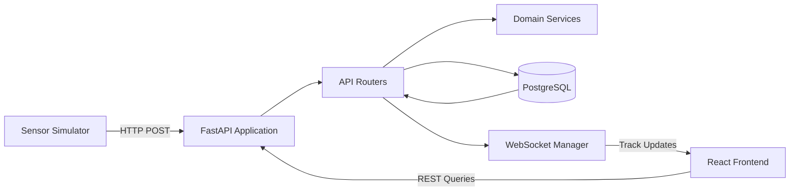
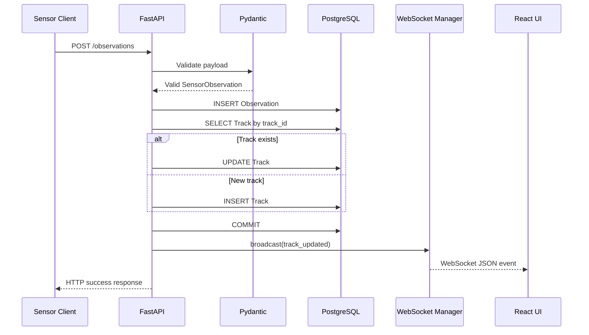
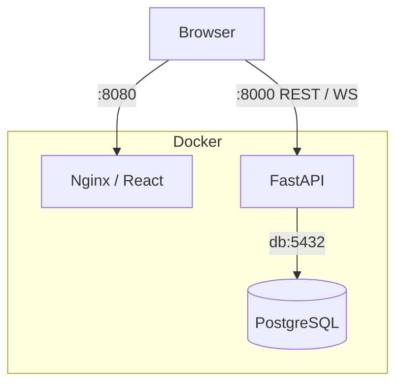

# Sensor Track System Architecture

## 1. Purpose

The Sensor Track System is a real-time tracking platform designed to ingest sensor observations, maintain current track state, preserve historical observations, and distribute updates to a live operator dashboard.

The architecture intentionally separates:

```text
sensor reports
current track state
historical state
business logic
transport
presentation
```

This separation allows each part of the system to evolve independently as the project grows toward more advanced tracking, correlation, and sensor-fusion capabilities.

---

## 2. High-Level Architecture



The system consists of four major runtime components:

```text
Sensor Simulator
       ↓
FastAPI Backend
       ↓
PostgreSQL Database
       ↓
React Operator Dashboard
```

Docker Compose provides the local runtime environment and networking between services.

---

# 3. Backend Architecture

The backend uses FastAPI as the HTTP and WebSocket application layer.

Application responsibilities are divided across:

```text
app/
├── config.py
├── main.py
├── database/
├── models/
├── routes/
├── schemas/
└── services/
```

Each layer has a distinct responsibility.

---

## 3.1 Application Entry Point

`app/main.py` is responsible for assembling the FastAPI application.

It handles:

```text
FastAPI initialization
CORS middleware
router registration
application-level configuration
root health-style endpoint
```

It does not contain observation-processing or track-management business logic.

Conceptually:

```text
main.py
   │
   ├── observations router
   ├── tracks router
   └── websocket router
```

This keeps the application entry point small and prevents route logic from becoming tightly coupled to application initialization.

---

# 4. Routing Layer

Routes are separated by responsibility.

```text
app/routes/
├── observations.py
├── tracks.py
└── websocket.py
```

Each module defines an `APIRouter`.

The route modules do not import the FastAPI application instance.

Instead:

```text
route module
    ↓
creates APIRouter

main.py
    ↓
include_router()
```

This avoids circular dependencies between the application entry point and route modules.

---

## 4.1 Observation Routes

The observation router handles historical sensor reports.

Primary responsibilities include:

```text
accept observations
validate input
persist observation history
create/update track state
broadcast updates
retrieve history
retrieve latest observations
```

The central write path is:

```text
POST /observations
```

---

## 4.2 Track Routes

The track router provides access to current track state.

Responsibilities include:

```text
retrieve all current tracks
retrieve an individual track
search/filter tracks
derive track status
calculate track age
```

Track search currently supports filtering by:

```text
sensor ID
minimum altitude
maximum altitude
minimum speed
maximum speed
```

Static routes such as:

```text
/tracks/search
/tracks/status
```

are declared before:

```text
/tracks/{track_id}
```

to prevent static route names from being interpreted as dynamic track IDs.

---

## 4.3 WebSocket Route

The WebSocket endpoint is:

```text
/ws/tracks
```

Clients connect once and remain connected while the application is active.

The route delegates connection management to the shared WebSocket manager.

```text
browser
   ↓
/ws/tracks
   ↓
ConnectionManager
```

The route itself does not maintain independent connection state.

---

# 5. Validation Layer

Incoming sensor observations are validated using Pydantic.

The sensor schema defines constraints including:

```text
latitude:
-90 <= latitude <= 90

longitude:
-180 <= longitude <= 180

heading:
0 <= heading < 360

speed:
speed >= 0
```

Timestamp input must contain timezone information.

A naive timestamp is rejected at the API boundary rather than allowing ambiguous time data to enter the system.

Valid timestamps are normalized to UTC.

This establishes a system rule:

```text
external timestamp
      ↓
validate timezone
      ↓
normalize UTC
      ↓
business logic / persistence
```

---

# 6. Persistence Architecture

PostgreSQL is the primary runtime database.

SQLAlchemy provides the ORM layer.

The current data design separates two related but fundamentally different concepts:

```text
Observation
Track
```

---

## 6.1 Observation Model

An observation represents one sensor report at one moment in time.

Example:

```text
TRK-1001

12:00:00 → position A
12:00:02 → position B
12:00:04 → position C
12:00:06 → position D
```

Every valid report creates a new observation row.

Observation records therefore represent historical event data.

They support:

```text
historical trails
charts
movement reconstruction
latest-report queries
future analytics
```

Observations are not overwritten when a track moves.

---

## 6.2 Track Model

A track represents the current known state associated with a track identifier.

Example:

```text
TRK-1001

sensor      RADAR-01
position    latest position
altitude    latest altitude
heading     latest heading
speed       latest speed
last_seen   latest report time
```

There is one current Track row per unique `track_id`.

When another observation arrives for an existing track, the Track record is updated.

This creates a CQRS-like distinction between:

```text
historical event data
        ↓
Observation

current state
        ↓
Track
```

without implementing full event sourcing.

---

# 7. Observation Write Flow

The most important backend workflow begins when the simulator or another client sends:

```text
POST /observations
```

The complete processing path is:



A key architecture decision is that broadcasting occurs after:

```text
db.commit()
```

This ensures connected clients are not told about state that failed to persist.

---

# 8. Transaction Boundary

The observation record and corresponding current-track update are committed together.

Conceptually:

```text
BEGIN

INSERT observation

UPDATE track
or
INSERT track

COMMIT
```

This prevents a state such as:

```text
observation persisted
track update failed
```

or the reverse from being intentionally committed as separate application operations.

As the system evolves, this transaction boundary becomes increasingly important for maintaining a coherent track picture.

---

# 9. Track Status Architecture

Track status is derived rather than stored as authoritative database state.

Current development states are:

```text
ACTIVE
STALE
DROPPED
```

The determination is based on:

```text
current UTC time - last_seen
```

Current development thresholds are:

```text
< 10 seconds
    ACTIVE

>= 10 seconds and < 30 seconds
    STALE

>= 30 seconds
    DROPPED
```

This design avoids permanently storing status values that can become incorrect merely because time has passed.

For example, if a track is stored as:

```text
ACTIVE
```

and then the sensor stops reporting, nothing would update that row to `STALE` unless another process ran.

Instead, status is derived whenever needed.

---

# 10. Time Handling

UTC is the internal time standard.

Incoming timestamps are normalized at the API boundary.

Database-returned timestamps are normalized again before internal datetime arithmetic using:

```text
ensure_utc()
```

Track age calculations use:

```text
age_seconds()
```

This defensive layer is useful because database engines can differ in how timezone metadata is returned.

For example:

```text
PostgreSQL
→ timezone-aware datetime

SQLite test database
→ may return naive datetime
```

The application therefore treats naive internally retrieved timestamps as UTC before performing arithmetic.

This creates a consistent invariant:

```text
business logic operates on UTC-aware datetimes
```

---

# 11. Service Layer

Domain behavior that does not belong directly to HTTP transport is placed under:

```text
app/services/
```

Current examples include:

```text
track_status.py
time_utils.py
web_socket_manager.py
```

This separation prevents routes from becoming responsible for unrelated implementation details.

The desired dependency direction is:

```text
route
  ↓
service
```

rather than:

```text
service
  ↓
FastAPI route
```

Services should remain reusable and, where possible, independent of FastAPI.

---

# 12. WebSocket Architecture

The WebSocket manager maintains the currently connected dashboard clients.

Conceptually:

```text
ConnectionManager

active_connections
├── client A
├── client B
└── client C
```

When a persisted track changes:

```text
Observation route
      ↓
manager.broadcast()
      ↓
all connected clients
```

The event currently uses:

```text
track_updated
```

and contains the current track state.

Example:

```json
{
  "event": "track_updated",
  "observation_id": 125,
  "track_id": "TRK-1001",
  "sensor_id": "RADAR-01",
  "latitude": 34.92,
  "longitude": -80.91,
  "altitude": 12000,
  "heading": 90,
  "speed": 180,
  "status": "ACTIVE",
  "last_seen": "2026-09-10T12:00:00+00:00"
}
```

The WebSocket channel handles changing live state while REST endpoints remain available for initial loading, historical data, and direct queries.

---

# 13. REST and WebSocket Responsibilities

REST and WebSockets solve different problems within the same system.

REST is currently used for:

```text
initial track load
historical queries
specific track lookup
search
filtering
latest observation retrieval
```

WebSockets are used for:

```text
live track updates
```

The frontend startup path therefore resembles:

```text
page loads
    ↓
GET current track picture
    ↓
open WebSocket
    ↓
receive incremental updates
```

This avoids rebuilding the entire track picture for every sensor report.

---

# 14. Frontend Architecture

The frontend is implemented using React and TypeScript.

Major responsibilities are separated into:

```text
components
hooks
services
types
configuration
```

The frontend does not communicate directly with PostgreSQL.

All state enters through:

```text
REST API
or
WebSocket
```

This preserves the backend as the authoritative application boundary.

---

## 14.1 REST Client

Frontend REST calls are centralized under:

```text
src/services/
```

The REST base URL comes from:

```text
VITE_API_URL
```

rather than being hard-coded in source files.

This allows the same frontend source to target different backend environments.

---

## 14.2 WebSocket Client

The WebSocket connection uses:

```text
VITE_WS_URL
```

The frontend hook receives `track_updated` events and updates current React state.

Conceptually:

```text
WebSocket event
      ↓
useTrackSocket
      ↓
App state update
      ↓
React re-render
      ↓
marker moves
```

If the updated track is currently selected, the observation can also be appended to its visible historical trail.

---

# 15. Frontend Track Status

The frontend independently derives track status from `last_seen`.

A one-second clock causes status to be recalculated even when the sensor is silent.

This is necessary because:

```text
no sensor report
      ↓
no WebSocket event
```

but time is still passing.

Without client-side aging, a marker could remain visibly `ACTIVE` forever after its final report.

The frontend therefore transitions:

```text
ACTIVE
  ↓
STALE
  ↓
DROPPED
```

without requiring another backend message.

The backend remains authoritative whenever track data is explicitly requested through the API.

---

# 16. Map Architecture

Leaflet provides the map layer.

Each current track is rendered using a custom marker.

The marker displays:

```text
track identifier
status
heading
```

Heading is represented by rotating the marker according to:

```text
track.heading
```

Track status affects marker presentation.

Historical observation positions are rendered separately from current Track state.

This distinction makes it possible to show:

```text
historical trail
        ↓
current track marker
```

without confusing previous sensor reports with current state.

---

# 17. Historical Visualization

When a track is selected, the frontend requests:

```text
GET /observations/{track_id}?limit=N
```

The backend retrieves the most recent observations in descending order for query efficiency:

```text
newest
↓
oldest
```

and reverses the result before returning it.

The frontend therefore receives:

```text
oldest
↓
newest
```

which is the natural order for:

```text
map trails
time-series charts
```

The live current position is connected to the end of the historical trail.

---

# 18. Simulator Architecture

The simulator acts as an external sensor client.

It intentionally does not directly modify the database.

Instead:

```text
Simulator
    ↓ HTTP
FastAPI
    ↓
Application rules
    ↓
PostgreSQL
```

This is important because simulated reports pass through the same validation and processing path that any future sensor client would use.

---

## 18.1 Motion Model

Track motion uses basic kinematics.

Starting with:

```text
speed
heading
elapsed time
```

speed is converted from knots to meters per second:

```text
knots × 0.514444
```

Distance traveled is:

```text
speed × elapsed time
```

Heading is resolved into:

```text
north component
east component
```

using:

```text
north = distance × cos(heading)
east  = distance × sin(heading)
```

The resulting displacement is converted approximately into latitude and longitude changes.

The simulator also applies small randomized changes to:

```text
heading
speed
altitude
```

to avoid perfectly linear motion.

---

# 19. Sensor Imperfections

The simulator intentionally generates imperfect data availability.

Supported behaviors include:

```text
single-report dropout
temporary sensor outage
reacquisition
new track generation
track termination
```

A short dropout may not be sufficient to make a track stale.

A longer outage can produce:

```text
ACTIVE
↓
STALE
↓
ACTIVE
```

following reacquisition.

Permanent termination eventually produces:

```text
ACTIVE
↓
STALE
↓
DROPPED
```

because no further observations update `last_seen`.

This allows the system to exercise track-aging logic under imperfect reporting conditions.

---

# 20. Configuration Architecture

Backend configuration is centralized using Pydantic Settings.

The priority is approximately:

```text
runtime environment variable
        ↓
.env value
        ↓
application default
```

This allows Docker Compose to override values such as:

```text
DB_HOST
DB_PORT
```

without modifying source code.

---

## 20.1 Local Database Addressing

When Python runs directly on Windows and connects to Docker PostgreSQL:

```text
Windows application
      ↓
localhost:5433
      ↓
Docker port mapping
      ↓
PostgreSQL :5432
```

---

## 20.2 Docker Database Addressing

When FastAPI runs inside Docker:

```text
backend container
      ↓
db:5432
      ↓
PostgreSQL container
```

The hostname:

```text
db
```

is resolved through the Docker Compose network.

---

# 21. Frontend Environment Configuration

The browser cannot use Docker-only service names such as:

```text
backend
```

because frontend JavaScript executes on the user's machine, not inside the Nginx container.

Therefore the Dockerized frontend currently accesses:

```text
http://127.0.0.1:8000
```

through the published backend port.

In a deployed environment, this can become:

```text
https://api.example.com
```

with WebSockets using:

```text
wss://api.example.com
```

Vite environment values are generally resolved during the frontend build process.

---

# 22. Docker Architecture

Docker Compose currently defines:

```text
db
backend
frontend
```

Conceptually:



The PostgreSQL service uses a named volume:

```text
postgres_data
```

so container recreation does not normally destroy the stored data.

---

# 23. Database Migration Architecture

SQLAlchemy models describe the application's expected schema.

Alembic controls how the real database moves between schema versions.

```text
SQLAlchemy model change
        ↓
Alembic revision
        ↓
review migration
        ↓
alembic upgrade head
        ↓
PostgreSQL schema updated
```

The backend container currently runs migrations before starting Uvicorn.

```text
container startup
      ↓
alembic upgrade head
      ↓
Uvicorn
```

For the current single-backend development environment, this provides a convenient deployment workflow.

For a future horizontally scaled production environment, schema migration would typically become a separate deployment step or job rather than being executed independently by every application replica.

---

# 24. Testing Architecture

Tests are located outside the application package:

```text
tests/
```

The test suite currently includes unit and route-level integration tests.

```text
Unit testing
    ↓
service/business logic only

Route testing
    ↓
FastAPI
Pydantic
SQLAlchemy
test database
```

The test suite currently contains 15 automated tests.

---

## 24.1 Unit Tests

Track status logic is tested independently of:

```text
FastAPI
HTTP
PostgreSQL
Docker
```

Tests inject a deterministic `now` value so time-dependent behavior does not depend on the system clock.

Boundary conditions are explicitly tested.

---

## 24.2 Route Tests

FastAPI's `TestClient` exercises routes through HTTP-like requests.

During tests, the normal database dependency:

```text
get_db()
```

is replaced with a test database dependency.

```text
FastAPI route
     ↓
dependency override
     ↓
isolated SQLite database
```

Tables are created before each test and removed afterward.

This prevents test records from contaminating development PostgreSQL data.

---

## 24.3 SQLite vs PostgreSQL

SQLite is currently used because it provides extremely fast isolated route testing.

However, SQLite and PostgreSQL do not behave identically.

One discovered difference involved timezone-aware SQLAlchemy fields:

```text
PostgreSQL
→ preserves timezone awareness

SQLite
→ may return naive datetime values
```

This led to the introduction of centralized UTC normalization.

Future test architecture may add a dedicated PostgreSQL integration-test environment for database-specific behavior while retaining SQLite for fast application tests.

---

# 25. Failure Boundaries

Several architecture decisions intentionally establish failure boundaries.

A malformed observation fails at:

```text
Pydantic validation
```

before reaching database logic.

A database failure prevents:

```text
WebSocket broadcast
```

because broadcasting happens only after persistence succeeds.

A disconnected frontend does not prevent:

```text
observation persistence
```

because the database is not dependent on a browser connection.

A simulator outage does not crash:

```text
FastAPI
PostgreSQL
React
```

because the simulator is an independent client.

These separations reduce coupling between components.

---

# 26. Current Data Flow

The complete runtime flow can be represented as:

```text
Synthetic object state
        ↓
Sensor Simulator
        ↓
SensorObservation JSON
        ↓
HTTP POST /observations
        ↓
Pydantic validation
        ↓
Observation INSERT
        ↓
Track SELECT
        ↓
Track INSERT / UPDATE
        ↓
PostgreSQL COMMIT
        ↓
Track status calculation
        ↓
WebSocket broadcast
        ↓
React state
        ↓
Leaflet marker update
        ↓
Operator display
```

Historical flow:

```text
Operator selects track
        ↓
GET /observations/{track_id}
        ↓
PostgreSQL history query
        ↓
chronological Observation[]
        ↓
React
        ↓
map trail + charts
```

---

# 27. Architectural Evolution

The current architecture deliberately establishes boundaries that can support future tracking functionality.

Future development may introduce:

```text
Observation
     ↓
association engine
     ↓
candidate tracks
     ↓
correlation logic
     ↓
state estimation
     ↓
fused Track
```

At that point, an incoming sensor-provided identifier may no longer be treated as identical to the system's authoritative track identity.

The system can evolve toward:

```text
sensor observation ID
        ≠
system track ID
```

which creates the foundation for real multi-sensor correlation.

---

# 28. Future Architecture Areas

Planned architectural areas include:

```text
multi-sensor association
track correlation
confidence scoring
classification
track quality
state estimation
Kalman filtering
prediction
geospatial events
authentication
authorization
structured logging
metrics
health monitoring
PostgreSQL test containers
CI/CD
cloud deployment
horizontal WebSocket scaling
message queues / event streaming
```

Not all of these are necessary for the system's current scope.

They represent logical growth paths as the project moves from a single-service tracking application toward a more distributed real-time architecture.

---

# 29. Design Principle

The project's core architectural principle is:

> Sensor observations are evidence. Tracks are system state.

A sensor report describes what one source observed at one point in time.

A track represents the system's evolving interpretation of an object over time.

The current implementation begins with a simple one-to-one association between incoming `track_id` and system `Track`.

Future iterations can replace that assumption with correlation, association, confidence, and state-estimation logic without needing to redesign the entire application boundary.