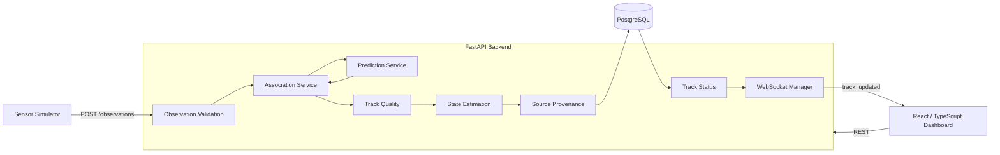
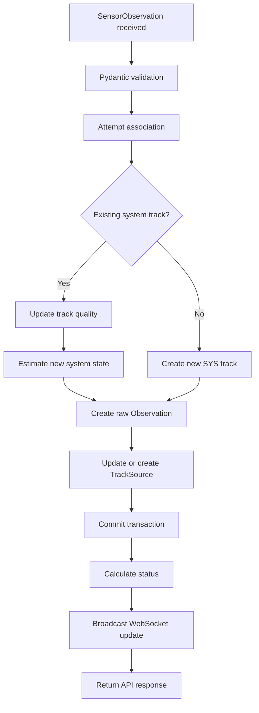
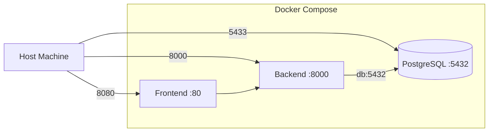

# Sensor Track System Architecture

## 1. Purpose and Scope

The Sensor Track System is a real-time multi-sensor tracking application that ingests synthetic sensor observations, associates them with system-owned tracks, maintains an estimated current track state, preserves observation history and source provenance, and streams updates to a React dashboard.

The architecture intentionally separates:

```text
sensor measurement
system identity
system state
source provenance
```

This document describes the implemented architecture rather than theoretical future sensor-fusion capabilities.

---

## 2. High-Level Architecture



The system follows a transactional event-processing model.

An incoming observation is not broadcast until its associated database changes successfully commit.

---

## 3. Identity Model

A central architectural decision is separating sensor-owned identity from system-owned identity.

Sensors provide:

```text
sensor_id
source_track_id
```

The application owns:

```text
track_id
```

Example:

```text
RADAR-01 / RDR-441
EO-02    / EO-827
        ↓
SYS-A1B2C3D4E5F6
```

`source_track_id` answers:

> What identity did the reporting sensor assign?

`track_id` answers:

> What object does this application currently believe these observations represent?

This prevents an individual sensor from becoming authoritative for system identity.

---

## 4. Persistence Model

Three primary models represent different kinds of information.

### Observation

An `Observation` is historical evidence representing exactly what a sensor reported.

Important fields include:

```text
sensor_id
source_track_id
track_id
latitude
longitude
altitude
heading
speed
timestamp
```

Observation kinematics remain raw.

They are not replaced with the smoothed system state.

### Track

A `Track` represents the application's latest belief about a system-level object.

Important state includes:

```text
track_id
sensor_id
quality
latitude
longitude
altitude
heading
speed
last_seen
classification
```

`Track.sensor_id` represents the latest contributing sensor.

The complete source history is maintained separately.

### TrackSource

`TrackSource` records source provenance.

Each row identifies a sensor/source identity that has contributed to one system track:

```text
track_id
sensor_id
source_track_id
first_seen
last_seen
observation_count
```

The uniqueness constraint is:

```text
track_id
+ sensor_id
+ source_track_id
```

A foreign key links `TrackSource.track_id` to `Track.track_id`.

---

## 5. Observation Ingestion Pipeline

The principal ingestion path is:

```http
POST /observations
```

The request flows through the following stages.



For newly created tracks, the SQLAlchemy session is explicitly flushed before inserting dependent `TrackSource` rows so PostgreSQL can satisfy the foreign-key relationship while preserving the larger transaction.

A flush is not a commit.

If later processing fails, the entire transaction can still roll back.

---

## 6. Observation Validation

`SensorObservation` validates incoming telemetry before tracking logic executes.

Current validation includes:

```text
latitude     -90 through 90
longitude    -180 through 180
heading      >= 0 and < 360
speed        >= 0
timestamp    timezone-aware
```

Timestamps are normalized to UTC.

Invalid observations are rejected before persistence or association.

---

## 7. Association Pipeline

Association occurs in two stages.

### 7.1 Source Continuity

The system first checks whether the exact:

```text
sensor_id + source_track_id
```

has recently contributed to an existing system track.

Direct source continuity currently uses a:

```text
60-second window
```

If the source is recent, the previous system identity is retained.

The resulting method is:

```text
SOURCE_CONTINUITY
```

This is stronger than simply searching historical observations because source identities are not trusted indefinitely.

### 7.2 Physical Correlation

If source continuity is unavailable or expired, normal physical correlation is attempted.

Candidate tracks must be recent enough to evaluate.

The current general association window is:

```text
20 seconds
```

For each candidate, the application compares the incoming observation against a predicted position and evaluates:

```text
geographic distance
altitude difference
speed difference
heading difference
time difference
```

Candidates outside configured gates are discarded.

---

## 8. Prediction

Association does not compare an incoming observation only against a candidate's previous recorded location.

The prediction service estimates where the candidate should be at the incoming observation time.

The current predictor uses:

```text
heading
speed
elapsed time
latitude
longitude
```

Speed is converted from knots to meters per second.

Motion is resolved into north/east components using the candidate heading.

The resulting predicted latitude and longitude are then used by the association distance calculation.

Prediction with negative elapsed time is rejected.

---

## 9. Association Gates

The current first-pass gates are intentionally understandable and configurable.

```text
Association time window       20 seconds
Maximum altitude difference   2000 ft
Maximum speed difference      100 kt
Maximum heading difference    60 degrees
Base distance gate            1000 m
```

The distance gate expands with expected travel:

```text
distance_gate
=
base_distance_gate
+
expected_travel * 1.5
```

where expected travel depends on speed and elapsed time.

---

## 10. Association Scoring

Candidates that survive all gates receive a normalized score.

Conceptually:

```text
score =
normalized distance
+ normalized altitude difference
+ normalized speed difference
+ normalized heading difference
```

Lower scores represent better matches.

The candidate with the lowest score is selected.

This means the association system is not simply a nearest-neighbor lookup.

A slightly farther candidate with strongly matching altitude, heading, and speed can beat a geographically closer candidate with poor kinematic agreement.

The automated test suite includes an ambiguous-candidate scenario specifically validating this behavior.

---

## 11. Association Confidence

Correlation scores are also translated into an explainable confidence label.

Current thresholds are:

```text
score <= 0.50        HIGH CONFIDENCE
0.50 < score < 1.00 MEDIUM CONFIDENCE
score >= 1.00        LOW CONFIDENCE
```

Association confidence describes one specific correlation decision.

It is distinct from persistent track quality.

---

## 12. Track Quality

Each system track maintains a quality value from:

```text
0.0 to 1.0
```

New tracks begin at:

```text
0.50
```

The current quality policy is:

```text
SOURCE_CONTINUITY
+0.05

CORRELATION score <= 0.50
+0.08

CORRELATION score < 1.00
+0.03

CORRELATION score >= 1.00
-0.05
```

Quality is clamped between:

```text
0.0 and 1.0
```

This produces an evolving indication of how much supporting evidence the application has accumulated for a system track.

Track quality does not represent freshness.

---

## 13. State Estimation

Raw incoming observations do not directly replace the current system state after initial track creation.

For existing tracks, the estimator combines:

```text
previous estimated state
+
incoming sensor measurement
```

using a configurable exponential blend.

The current default is:

```text
alpha = 0.65
```

For linear state fields:

```text
new estimate
=
alpha × measurement
+
(1 - alpha) × previous estimate
```

The estimator currently smooths:

```text
latitude
longitude
altitude
speed
heading
```

### Circular Heading Estimation

Heading requires circular arithmetic.

A transition from:

```text
359° → 1°
```

must not be interpreted as a 358-degree turn.

The estimator determines the shortest signed angular difference and blends across the 0/360-degree boundary.

This keeps heading behavior consistent with the physical meaning of the measurement.

The estimator intentionally remains simple and explainable rather than implementing a Kalman filter or other advanced state-estimation system.

---

## 14. Source Provenance

Every successfully processed observation updates source provenance.

For an existing contributor:

```text
last_seen
observation_count
```

are updated.

For a new contributor, a new `TrackSource` row is created with:

```text
first_seen
last_seen
observation_count = 1
```

This makes it possible to determine which sensors have supported a system track over time instead of relying only on the most recent sensor.

---

## 15. Source Expiration and Reacquisition

Source continuity and system identity have separate lifecycles.

Consider:

```text
RADAR-01 / RDR-100
        ↓
SYS-ABC
```

If RADAR-01 disappears for longer than the continuity window, `RDR-100` is no longer automatically trusted.

However, another sensor may continue updating:

```text
EO-02 / EO-200
        ↓
SYS-ABC
```

If RADAR-01 later returns, the expired source ID must pass physical correlation.

If it matches the still-active system track:

```text
CORRELATION
        ↓
RADAR-01 rejoins SYS-ABC
```

This allows system identity to survive temporary loss of one source without trusting source IDs forever.

---

## 16. Track Freshness

Freshness is derived from:

```text
current time - Track.last_seen
```

Current thresholds:

```text
age < 10 sec       ACTIVE
age >= 10 sec      STALE
age >= 30 sec      DROPPED
```

Boundary behavior is covered by unit tests.

Status and quality remain intentionally independent.

Example:

```text
quality = 0.94
status  = DROPPED
```

means the system had strong historical support for the track, but has not received a recent observation.

---

## 17. Transaction Model

Observation processing uses one database transaction for the related changes.

Conceptually:

```text
Track update/create
Observation creation
TrackSource update/create
        ↓
single commit
```

Successful tracking events are logged and broadcast only after the transaction commits.

If commit fails:

```text
db.rollback()
```

is executed and an error-level structured log is emitted.

This prevents clients from receiving a track update that was never successfully persisted.

---

## 18. REST API

FastAPI provides REST endpoints for current and historical system data.

Major route families include:

```text
/observations
/tracks
/health
/ready
```

Track APIs support current-state inspection, searching, status-based workflows, and source-provenance inspection.

The source endpoint:

```http
GET /tracks/{track_id}/sources
```

returns all contributing sensor/source identities for the requested system track.

---

## 19. WebSocket Distribution

The live dashboard connects to:

```text
/ws/tracks
```

After a successful transaction, the backend broadcasts a `track_updated` message containing current system state and association metadata.

The frontend therefore does not need to repeatedly poll PostgreSQL for every change.

REST provides initial/historical data.

WebSockets provide live state changes.

---

## 20. Frontend Architecture

The dashboard is implemented with React and TypeScript.

Major UI capabilities include:

```text
interactive Leaflet map
live track markers
heading-based marker rotation
track selection
track trails
search
filters
status display
track quality display
sensor display
position and kinematics
historical charts
```

Shared TypeScript interfaces define current track state and WebSocket track updates.

`TrackUpdate` extends the base `Track` interface rather than duplicating common state definitions.

---

## 21. Simulator

The synthetic sensor simulator provides repeatable development traffic.

It generates observations approximately every two seconds and models behaviors such as:

```text
movement
multiple sensors
temporary outages
reacquisition
spawning
termination
```

Motion uses basic heading/speed-based geographic updates.

The simulator is synthetic and intentionally limited.

It is designed to exercise the software architecture rather than reproduce an operational sensor model.

---

## 22. Docker Topology

The application runs as three primary Docker Compose services:



Host-side development tools connect to PostgreSQL using:

```text
localhost:5433
```

The backend container connects using:

```text
db:5432
```

These are intentionally different network contexts.

PostgreSQL data is stored in the persistent:

```text
postgres_data
```

Docker volume.

---

## 23. Database Migrations

Alembic owns production/development schema evolution.

The backend container starts using:

```text
alembic upgrade head
        ↓
uvicorn
```

This ensures pending schema changes are applied before application traffic is served.

Schema changes implemented during the project include:

```text
initial observations/tracks schema
track classification
source_track_id
track quality
track_sources provenance table
```

---

## 24. Health and Readiness

The backend exposes:

```http
GET /health
```

for application liveness.

It also exposes:

```http
GET /ready
```

for dependency readiness.

`/ready` performs a database query equivalent to:

```sql
SELECT 1;
```

Docker uses the readiness endpoint as the backend container healthcheck.

This means a running Python process alone is not sufficient for the backend to be considered healthy.

---

## 25. Structured Logging

Python's standard logging framework emits concise application-level tracking events.

Examples include:

```text
event=TRACK_CREATED
event=SOURCE_CONTINUITY
event=TRACK_CORRELATED
event=OBSERVATION_COMMIT_FAILED
```

Normal telemetry values are not continuously dumped into logs.

The goal is to log tracking decisions and failures rather than recreate the observation stream in console output.

---

## 26. Testing Architecture

The backend test suite currently contains:

```text
63 passing tests
```

Tests use an isolated in-memory SQLite database.

SQLite foreign-key enforcement is explicitly enabled so relational behavior more closely resembles PostgreSQL.

Coverage includes:

```text
track status
observation ingestion
validation
history
REST routes
multi-sensor association
prediction
ambiguous candidates
confidence thresholds
track quality
source provenance
continuity expiration
reacquisition
state estimation
circular heading handling
foreign-key relationships
health/readiness
```

Pure computational services such as prediction, status, quality, and state estimation are intentionally separated from FastAPI and SQLAlchemy concerns where practical.

This makes the tracking behavior easier to test independently.

---

## 27. Key Architectural Decisions

### Sensor identity is not system identity

This enables multiple sensors to contribute to one authoritative application track.

### Observations remain raw

Historical evidence is not modified when the system's estimate changes.

### Track represents system belief

The track table stores the current estimated state rather than simply duplicating the latest observation.

### Source provenance is persistent

The application can explain which sources have contributed to a system track.

### Source IDs expire

A historical sensor ID is not trusted forever.

### Freshness and quality are independent

A well-established track can still be stale or dropped.

### Tracking logic remains explainable

The current system intentionally stops short of advanced state-estimation mathematics such as Kalman filtering.

The objective is a defensible, testable implementation whose major design decisions can be clearly explained.

---

## 28. Current Boundaries

The current application is a synthetic development and portfolio system.

It does not currently attempt to provide:

```text
operational sensor fusion
production aerospace navigation
Kalman filtering
probabilistic covariance modeling
distributed event streaming
high-availability database clustering
real sensor ingestion
classified data processing
```

These are intentionally outside the current project scope.

Future work is primarily focused on software-engineering maturity, deployment, documentation, observability, and demonstration quality rather than unnecessary increases in tracking algorithm complexity.